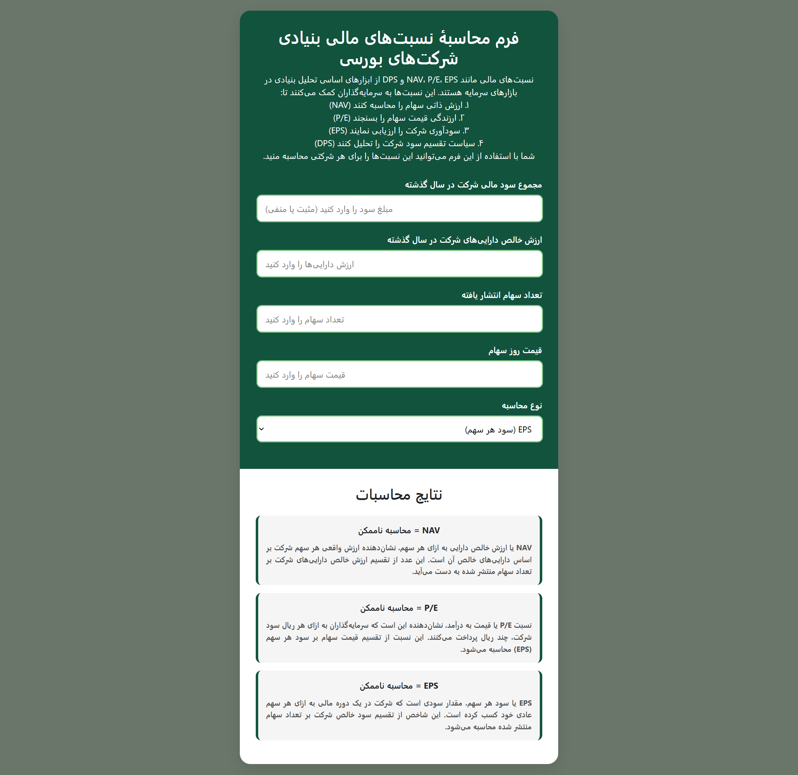

## نسبت‌های مالی اولیه در بازارهای سهامی
در این پروژه پایه‌ای ترین نسبت‌های مالی در بازار سهام پرداخته شده و با استفاده از Html,Css,JavaScript پیاده‌سازی شده است. هدف اصلی از این پروژه یادگیری طراحی یک پیج ریسپانسیو با استفاده از جاوااسکریپت و مبانی طراحی صفخات وب با استفاده از html, Css بوده است.

- محاسبه نسبت‌های مالی مهم شامل NAV، P/E، EPS و DPS و تحلیل آن‌ها (توضیحات تحلیل در قسمت بررسی کدهای تحلیلی)
- اعتبارسنجی ورودی‌ها
- نمایش پیام‌های تحلیلی بر اساس نتایج
- رابط کاربری ساده و ریسپانسیو

## 1. نسبت‌های مالی بر اساس فرمول‌های
```math
NAV = \frac{total \ asset \ value}{number of outstanding shares}
```
```math
P/E = \frac{stock \ price}{Eps}
```
```math
Eps = \frac{net \ income}{number \ of \ outstanding \ shares}
```
```math
Dps = Eps * special \ dividends
```

## 🧩 ساختار کد

### 1. کلاس اصلی FormulaCalculator

```javascript
class FormulaCalculator {
    constructor() {
        this.formulaElements = document.querySelectorAll('formula');
        this.init();
    }
```
- **توضیح**: نقطه شروع برنامه که المان‌های فرمول را جمع‌آوری کرده و init را اجرا می‌کند.

### 2. متد init

```javascript
init() {
    document.querySelectorAll('input[type="number"], select').forEach(input => {
        input.addEventListener('input', () => {
            let sign = this.validateInput(input);
            if (sign) {
                this.calculateAll();
            }
        });
    });
    
    document.getElementById('calculationType').addEventListener('change', () => {
        this.calcualteTypeEventListener();
        this.calculateAll();
    });
    
    this.calculateAll();
}
```
- **وظیفه**: در init تنظیم event listeners برای فیلدهای ورودی و سلکتور eps,dps صورت می‌گیرد و برای بار اول تابع calculateAll صدا زده می‌شود تا مقدارهای اولیه به خروجی‌ها داده شود.
- **Responsive**: پس از هر تغییر در هر یک از فیلدهای ورودی یا سلکتور، ایونت لیسنر مربوطه صدا زده می‌شود و تابع‌هایی که اعتبار ورودی‌ها را بررسی می‌کنند و سپس محاسبات را انجام می‌دهند صدا زده می‌شود.

### 3. مدیریت نوع محاسبه (EPS/DPS)

```javascript
calcualteTypeEventListener() {
    if (this.getCalculationType() === 'dps') {
        dpsGroup.classList.remove('hidden');
        epsResult.classList.add('hidden');
        dpsResult.classList.remove('hidden');
    } else {
         dpsGroup.classList.add('hidden');
         epsResult.classList.remove('hidden');
         dpsResult.classList.add('hidden');
    }
}
```
- **توضیح**: ما در صورتی که کاربر eps را بخواهد به او در خروجی نمایش می‌دهیم ولی اگر dps را بخواهد ابتدا یک فیلد ورودی دیگر به او نمایش داده می‌شود تا درصد سود پخش شده توسط شرکت را وارد کند و سپس dps محاسبه می‌شود.


### 4. اعتبارسنجی ورودی‌ها

```javascript
validateInput(input) {
    const value = parseFloat(input.value);
    const errorElement = document.getElementById(`${input.id}Error`);

    errorElement.style.display = 'none';
    input.classList.remove('error');
        
    if (input.id === 'dividendPercentage') {
        if (isNaN(value) || value < 0 || value > 100) {
            input.classList.add('error');
            errorElement.textContent = 'لطفاً عددی بین 0 تا 100 وارد کنید';
            errorElement.style.display = 'block';
            return -1;
        }    
    } else if (input.id === 'profit') {
        if (isNaN(value)) {
            input.classList.add('error');
            errorElement.textContent = 'لطفاً عددی وارد کنید؛ درصورت زیان‌ده بودن شرکت عددی منفی وارد کنید';
            errorElement.style.display = 'block';
            return -1;
        }
    } else {
        if (isNaN(value) || value <= 0) {
            input.classList.add('error');
            errorElement.textContent = 'لطفاً عددی مثبت وارد کنید';
            errorElement.style.display = 'block';
            return -1;
        }
    }
    return 1;
}
```
- **قوانین**:
  - درصد تقسیم سود در حالت dps باید بین 0 تا 100 باشد.
  - سود می‌تواند منفی باشد. (برای شرکت‌های زیانده)
  - سایر فیلدها باید اعداد مثبت باشند.

**درصورتی که این موارد رعایت نشده باشند یک باکس زیر باکس‌های ورودی نمایش داده می‌شود که حاوی پیغام خطا است و باتوجه به اینکه تابع خروجی دارد، اگر خروجی این تابع یک باشد فیلدهای تاثیر پذیر از فیلد آپدیت شده محاسبه نخواهند شد.**

### 5. محاسبه نسبت‌های مالی


```javascript
calculateFormula(formulaElement) {
    const expression = formulaElement.getAttribute('evaluator');
    const prefix = formulaElement.getAttribute('output-prefix') || '';    
    let evaluatedExpression = expression;
    const variables = expression.match(/[a-zA-Z]+/g) || [];
    variables.forEach(variable => {
        const inputElement = document.getElementById(variable);
        if (inputElement) {
            const value = inputElement.value ? parseFloat(inputElement.value) : 0;
            evaluatedExpression = evaluatedExpression.replace(new RegExp(variable, 'g'), value);
        }
    });

    const result = eval(evaluatedExpression);
    let formattedResult;
    if ((isNaN(result) || !isFinite(result)) || (result == 0 && (document.getElementById('profit').value == '' ))) {
        formattedResult = 'محاسبه ناممکن';
    } else {
        formattedResult = result.toLocaleString('fa-IR');
    }    
    formulaElement.textContent = prefix + formattedResult;
}
```
- **فرآیند**:
  1. ابتدا فرمول‌ها خوانده می‌شوند و مقادیری که در فیلدها نوشته شده‌اند نیز خوانده شده و درصورت یکه خالی بوده باشند 0 لحاظ می‌شوند.
  2. متغیرها در فرمول گفته شده جایگزین شده و مقدار در evaluatedExpression محاسبه می‌شود
  3. در انتها باتوجه به اینکه آیا مقدار، مورد قبول است پاسخ نهایی به پرفیکس جواب اضافه شده و نمایش داده می‌شود.

### 6. تحلیل‌های خودکار

```javascript
 this.checkNav();
 this.checkDpsPercentage();
 this.checkEps();
 this.checkPe();
```
- **انواع تحلیل**:

در توابع بالا مقادیر محاسبه شده برای این فیلدها مورد بررسی قرار می‌گیرند و باتوجه به مقدار پیغام مناسبی برای تحلیل بهتر برای فرد نمایش داده خواهد شد.
  - مقایسه قیمت با ارزش ذاتی (NAV): درصورتی که مقدار NAV محاسبه شده از قیمت سهام کمتر باشد یعنی سهام بالاتر از ارزش ذاتی معامله می‌شود و بالعکس.
  - تحلیل درصد تقسیم سود (DPS): درصورتی که تمام فیلدهای مربوط به محاسبه این مورد وارد شده باشد و درصد سود تقسیمی کمتر از 40 باشد، یعنی شرکت سود کمی را میان سهامداران تقسیم می‌کند.
  - بررسی سود هر سهم (EPS): درصورتی که سود سهم از مقداری کمتر یا منفی باشد یعنی شرکت وضعیت مناسبی ندارد ولی لزوما بالا یا پایین بودن این مقدار برای تحلیل کافی نیست و باید تمامی موارد بررسی شوند.
  - ارزیابی نسبت P/E: نسبت پایین P/E نشان دهنده آن است که قیمت سهم نسبت به سود بالای آن پایین است و عملا این عدد به این معنی است در صورتی که شما ان سهام را بخرید پس از چند سال به اندازه اصل سرمایه خود سود سالانه از شرکت دریافت می‌کنید.- P/E ratio evaluation: The low P/E ratio indicates that the share price is low to its high profit, and that means that if you buy the stock after a few years you will receive an annual profit from the company.


### بررسی کدهای HTml

```HTML
<div class="input-group">
    <label for="profit">مجموع سود مالی شرکت در سال گذشته</label>
    <input type="number" id="profit" placeholder="مبلغ سود را وارد کنید (مثبت یا منفی)">
    <div class="message-box error-message" id="profitError"></div>
</div>
```
- **ورودی‌ها:**
    - در قسمت ورودی‌ها ما کلاسی را برای استایل دهی در CSS قرار می‌دهیم و در هر ورودی یک id منحصر به فرد می‌گذاریم تا بتوانیم هر فیلد را در جاوا اسکریپت بخوانیم؛ همچنین برای هر فیلد یک باکس پیام برای حالاتی که ورودی نامعتبر باشد قرار دارد.
    - استایل دهی ارورها نیز به شکل بالا صورت می‌گیرد تا در هنگام ارورها فیلدها قرمز شوند و پیام در باکسی مناسب نمایش داده شود , در حالت رمال نیز استایلی باا رنگ سبز و متناسب با رنگ بادی داشته باشد همچنین فیلدهای افزایش و کاهش تک عددی برای فیلدهای اعداد را نیز حدف می‌کنیم زیرا در این مقادیر نیازی به آن نیست.

```CSS
.input-group {
    margin-bottom: 20px;
}

.input-group label {
    display: block;
    margin-bottom: 8px;
    font-weight: bold;
}

.input-group input, .input-group select {
    width: 100%;
    padding: 12px 15px;
    border-radius: 10px !important;
    border: 2px solid var(--secondary-color);
    background-color: white;
    transition: all 0.3s;
}

.input-group input.error {
    border-color: var(--danger-color);
}

input[type=number]::-webkit-inner-spin-button, 
input[type=number]::-webkit-outer-spin-button { 
    -webkit-appearance: none; 
    margin: 0; 
}

input[type=number] {
    -moz-appearance: textfield;
}

.input-group input:focus, .input-group select:focus {
    outline: none;
    border-color: var(--dark-color);
    box-shadow: 0 0 0 2px rgba(46, 125, 50, 0.3);
}
```

```HTML
<div class="result-item">
    <formula evaluator="assets/shares" output-prefix="NAV = "></formula>
    <div class="result-description">
 متن توضیح فیلد
    </div>
    <div class="message-box warning-message" id="navHighMessage"></div>
    <div class="message-box success-message" id="navLowMessage"></div>
</div>
```
- **خروجی‌ها:**
    - در قسمت خروجی‌ها نیز در یک خط مقدار خروجی را قرار می‌دهیم و چند خط توضیح این فیلد را قرار دادیم. سپس باتوجه به روشی که در بالاتر گفتیم در باکس‌های مسیج پیام مناسبی را باتوجه به مقدار آن خروجی قرار می‌دهیم.
    - در قسمت استایل‌ها نیز برای باکس‌های مسیج باتوجه به نوع آن رنگ و استایل در نظر گرفتیم و هر خروجی را نیز به طور کلی در یک باکس قرار می‌دهیم.

```CSS
.results-container {
    background-color: white;
    padding: 30px;
}

.result-item {
    background-color: #f5f5f5;
    border-radius: 10px;
    padding: 15px;
    margin-bottom: 15px;
    font-weight: bold;
    text-align: center;
    position: relative;
    transition: all 0.3s;
    border-right: 5px solid var(--primary-color);
    border-left: 5px solid var(--primary-color);
}

.result-description {
    font-size: 14px;
    margin-top: 10px;
    color: #555;
    text-align: justify;
    line-height: 1.6;
}

.message-box {
    font-size: 14px;
    margin-top: 10px;
    padding: 10px;
    border-radius: 5px !important;
    text-align: center;
    display: none;
}

.error-message {
    background-color: rgba(255, 255, 255, 0.2);
    color: rgb(116, 2, 2);
    border-right: 3px solid rgb(116, 2, 2);
    border-left: 3px solid rgb(116, 2, 2);
}

.warning-message {
    background-color: rgba(255, 152, 0, 0.2);
    color: var(--warning-color);
    border-right: 3px solid var(--warning-color);
    border-left: 3px solid var(--warning-color);
}

.info-message {
    background-color: rgba(33, 150, 243, 0.2);
    color: #2196f3;
    border-right: 3px solid #2196f3;
    border-left: 3px solid #2196f3;
}

.success-message {
    background-color: rgba(76, 175, 80, 0.2);
    color: var(--success-color);
    border-right: 3px solid var(--success-color);
    border-left: 3px solid var(--success-color);
}
```

  

